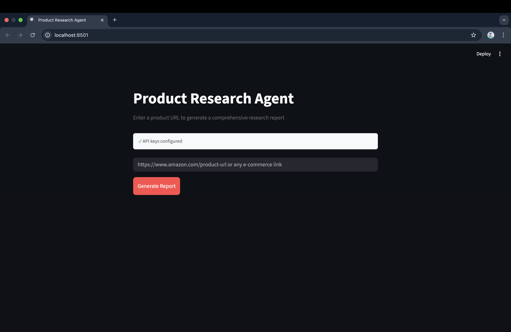
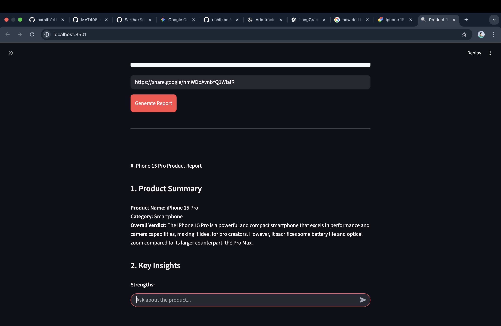
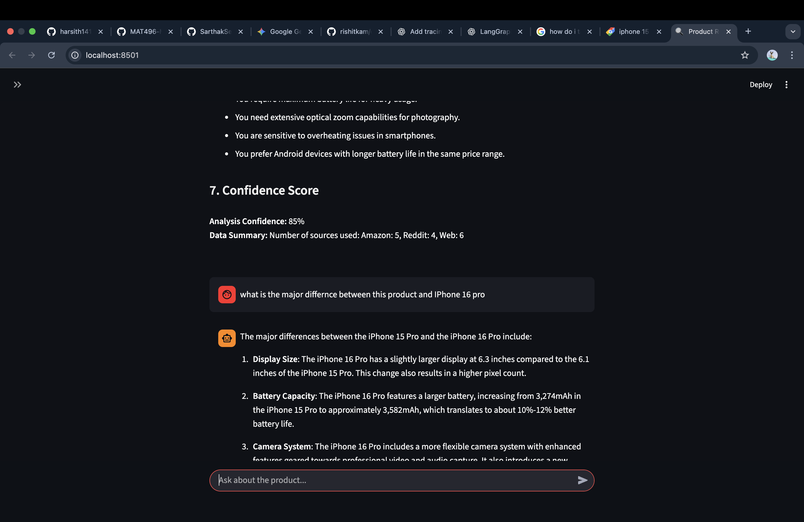

Template for creating and submitting MAT496 capstone project.

# Overview of MAT496

In this course, we have primarily learned Langgraph. This is helpful tool to build apps which can process unstructured `text`, find information we are looking for, and present the format we choose. Some specific topics we have covered are:

- Prompting
- Structured Output 
- Semantic Search
- Retreaval Augmented Generation (RAG)
- Tool calling LLMs & MCP
- Langgraph: State, Nodes, Graph

We also learned that Langsmith is a nice tool for debugging Langgraph codes.

------

# Capstone Project objective

The first purpose of the capstone project is to give a chance to revise all the major above listed topics. The second purpose of the capstone is to show your creativity. Think about all the problems which you can not have solved earlier, but are not possible to solve with the concepts learned in this course. For example, We can use LLM to analyse all kinds of news: sports news, financial news, political news. Another example, we can use LLMs to build a legal assistant. Pretty much anything which requires lots of reading, can be outsourced to LLMs. Let your imagination run free.

-------------------------

# Project report Template

## Title: Product Researcher Agent

## Overview

For this project, I built a **Product Research Agent** which is basically, an AI tool that does the heavy lifting of online shopping research for me. You just give it a product link, and it goes off to scour the web. It looks at the product page, checks Amazon reviews, digs through Reddit threads for real opinions, and searches the wider web for blog posts or videos. Basically, it does all the tedious and irritating work of researching about a product.

Once it has all that info, it puts together a neat, easy-to-read report with the pros, cons, and a final verdict. My initial plan was to just end the project here i.e. the report generation will be the last output but I went ahead and also added a chat feature so that the user can ask up follow up questions about the product and it answers based on what it found on the web and the report it compiled. It's designed to save anyone from opening 50 tabs and go though hundereds and thousands of reviews to find out what a product is like. 

I further had an idea of adding parallel nodes that can research about two different products at the same time but that was very resource intensive hence I had to drop that idea but this project can be further extended into a product comparison agent rather than just being a product researcher.

How it works: 
The system uses LangGraph to manage a team of parallel research agents. It simultaneously:
  * Scrapes e-commerce specs from Amazon.
  * Digs through Reddit threads to find unfiltered, honest user opinions.
  * Searches the wider web for expert blog posts and video transcripts.
  * Finally uses the information gathered from the different sites to put together a detailed report which the user can read to make an informed decison about the product.
  * Now the user can chat with this researcher by asking follow up questions on the report or regarding the products or maybe ask it to provide completely new recommendations about the products which are better than this and then the user can ask it to        compare these products. The chatbot does this with the help of a web search tool and the report that it made.

I further used streamlit to make a simple UI (which was completely made with the help of AI) to present my project in a better way so that it looks interactive and the reports are easy to read and analyse. 

## Reason for picking up this project

I picked this project for two main reasons. First, I wanted a practical way to revise everything I learned in the LangGraph course. Instead of just watching videos, I wanted to try to apply the concepts and things that I've learned in the duration of this course even if it meant making a simple RAG application like mine.

I also wanted to build something useful. We all spend too much time and efforts on reading reviews on multiple websites, consulting different people and analyzing products before buying. By automating this with an agent that can read hundreds of reviews in seconds using RAG and generate a useful report based on these reviews, I solved a real-world problem ( simple yet existent)  while using LangGraph, Tool calls, RAG, Agentic workflows etc

Further this projects completely lines up with everything that I learned in this course and here are some annotations that demonstrate that:

1. LangGraph (State, Node, Graph): This workflow is built with the help of it where the logic is split into modular nodes which are connected with each other using concrete or conditional edges.
2. SubGraphs: Particularly, I isolated the research part into a subgraph of its own and integrated it with the main graph.
3. MapReduce(Parallelization): To make the execution faster I, instead of running analysts one after the other, I ran them in parallel using Send API of LangGrAPH.
4. Prompting: My researcher nodes and the report generator node uses a detailed prompt template so that we get desired output and not generic stuff.
5. Structured Output: A Structured Output layer then forces all results into clean JSON/Pydantic formats producing consistent and readable reports.
6. Tool Calling LLMs: The chat node is connected with a web search tool which helps my LLM to search the web for some information which is related to some other product or it is not mentioned in the report.
7. Semantic Search: I used semantic search inside the Research Engine sub-graph, where each analyst’s query is matched to contextually relevant web results before being summarized.
8. RAG : I used RAG in the analyst research workflow, where retrieved web data and summaries are fed back into the graph as grounded context before the analysts generate their final insights.
9. LangSmith tracing: I used @trace function decorator to trace the working of few nodes in LangSmith dashboard.
10. Persistence: I used persistence to save the graph’s state, so the system can pause and continue later without starting over with this I also used summarizer so that our context doesnt become very long.
11. MemorySaver: I used MemorySaver to save temporary steps of the graph onto the disk. This reduces memory load, prevents crashes during heavy tasks, and keeps the whole system running smoothly even when multiple analysts are working at the same time.

## Video Summary Link: 

Make a short -  3-5 min video of yourself, put it on youtube/googledrive, and put its link in your README.md.

- you can use this free tool for recording https://screenrec.com/
- Video format should be like this:
- your face should be visible
- State the overall job of your agent: what inputs it takes, and what output it gives.
- Very quickly, explain how your agent acts on the input and spits out the output. 
- show an example run of the agent in the video

## Plan

I plan to execute these steps to complete my project.

- [DONE] Step 1: Install dependencies required for the project and create `state.py` to define the states required for the application. They will act like custom data strcutures which are used to store information between nodes.
- [DONE] Step 2: Create `nodes.py` and implement all the nodes logic one by one. Implement the parse_link node which will parse the product link and extract the product name.
- [DONE] Step 3: Implement three distinct researcher functions and wire them to run in parallel.
- [DONE] Step 4: Implement the nodes to process the data gathered by the researchers and extract the pros, cons, and final conclusion.
- [DONE] Step 5: Implement the node that will synthesize all the analyzed data into a clean, professional Markdown report, acting as the final output of the research phase.
- [DONE] Step 6: Connect the research subgraph with the main graph and all other nodes in the `graph.py`.
- [DONE] Step 7: Implement a node that will handle the chat logic and bind a web search tool to handle follow-up questions. Also implement a node that will summarize the history when the number of messages exceeds 5. Also implement MemorySaver to save the chat history.
- [DONE] Step 8: Build a simple web UI using Streamlit to interact with the agent in `web_ui.py`.

## Conclusion:

I had planned to build a robust, autonomous Product Research Agent that could take a simple URL and perform the kind of deep-dive analysis that usually takes me hours. My goal was to leverage the full power of LangGraph to do parallel research, synthesize data using RAG, and provide a conversational interface for follow-up questions.

I think I have achieved this conclusion satisfactorily.

The reason for my satisfaction is that the final application is a genuinely useful tool. I successfully implemented a complex graph with parallel branches (Amazon, Reddit, Web Researcher) that merge back for analysis. The RAG pipeline works as intended, the agent retrieves real, diverse evidence via Tavily and puts it back into a structured, unbiased report that actually helps the user in making buying decisions. The addition of the persistent chat with memory (`MemorySaver`) transformed the project from a static report generator into an interactive assistant and I'm quite happy about it because I didn't plan that initially. The Streamlit UI is simple, clean, responsive, and handles the workflow seamlessly.

Overall, I'm pretty satisfied with what I made. It helped me revisit the topics that I learned in the duration of this course and actually implement them. I am a bit unsatisfied with the features that I have right now and maybe the simplicity of the project but I tried my best to use as many concepts as I can.

**Working of the project**

The landing page:

Adding a product Link amd clicking generate report:

Asking follow up questions comparing this product with another product

----------

# Added instructions:

- This is a `solo assignment`. Each of you will work alone. You are free to talk, discuss with chatgpt, but you are responsible for what you submit. Some students may be called for viva. You should be able to each and every line of work submitted by you.

- `commit` History maintenance.
  - Fork this repository and build on top of that.
  - For every step in your plan, there has to be a commit.
  - Change [TODO] to [DONE] in the plan, before you commit after that step. 
  - The commit history should show decent amount of work spread into minimum two dates. 
  - **All the commits done in one day will be rejected**. Even if you are capable of doing the whole thing in one day, refine it in two days.  
 
 - Deadline: Dec 2nd, Tuesday 11:59 pm

# Grading: total 25 marks

- Coverage of most of topics in this class: 20
- Creativity: 5
  
